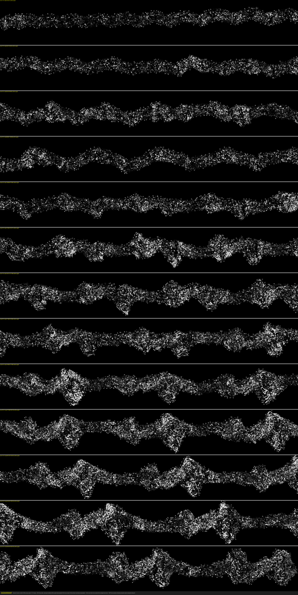
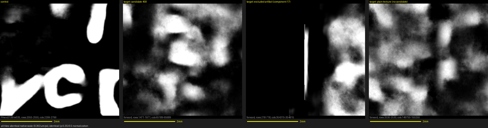

# First Light — PHerc. 0826

We tried to read PHerc. 0826 with the tools the Vesuvius team published on
August 18. This is what worked, what broke, what it cost, and what we saw.

## First public look



This is the flattened inside of PHerc. 0826, windings w010–w065 of slices
10,000–11,000 — the first rendered look inside this scroll that we know of.
Pipeline: villa at commit `6847063`, spiral fit (30,000 steps) → lasagna
flatten → `vc_render_tifxyz` → `ink_9um` inference, run as published, with
the fixes linked below. Before reading anything into the image, see
[`prereg/readout.md`](prereg/readout.md) for what we committed to count as
ink — we wrote the rules before we looked.

## What broke on the way

Three walls, each now a villa PR with the real error and the fix:

- [#1627](https://github.com/ScrollPrize/villa/pull/1627) — `render_ink.py`
  had no way to reach a volume that only exists on S3; six-line
  `--remote-url` passthrough, tested end-to-end on this scroll.
- [#1628](https://github.com/ScrollPrize/villa/pull/1628) — the
  `spiral-scroll.json` file the fitter requires is documented nowhere; we
  reconstructed the schema from error messages one field at a time and
  wrote it down, including the `lasagna_scale` value that fails confusingly
  when copied from an example.
- [#1629](https://github.com/ScrollPrize/villa/pull/1629) — the default fit
  window is the entire scroll, and what actually happens then is a silent
  death, not the out-of-memory error you'd expect.

There was a fourth wall with no PR: nothing documents how to determine a
scroll's winding sense. Visual inspection was ambiguous, a regression over
180,000 track points had no signal, and the answer finally came from the
code itself (the ACW setting is literally a mirror flip) plus overlaying
both fitted meshes on the real slice. The full saga is in
[`runbook/02c_f3_preflight.md`](runbook/02c_f3_preflight.md).

## What we actually see



**"I didn't see any ink in the window."**

That's the preregistered verdict, published verbatim from
[`prereg/readout.md`](prereg/readout.md). How we got there: the identical
pipeline first ran on a control segment with published ground-truth labels
(PHerc. 0139/w035, from the model's own training set — a pipeline check,
not a generalization test). It reproduced legible letterforms with the
labels landing on top, and gave us our threshold: 0.7843, the median
probability on labeled ink. On the target, 23,569 of ~1.79 billion pixels
crossed that threshold in both directions, forming nine candidates above
our 0.5 mm size floor. Eight are sharp vertical bands at rendering
boundaries — excluded by rules we committed in advance. The ninth is a
0.55 mm diffuse patch that looks like the plain texture tile, not like the
control's strokes. Every number and crop is in
[`analysis/`](analysis/target-PHerc0826-window1-full-w010-065/); the audit
trail is in [`prereg/readout.md`](prereg/readout.md).

One disclosure we owe you next to these images: the checkpoint's inference
patch is 128×128 px = 1.198 mm, larger than the 0.5×0.5 mm the prize page
recommends for ML-generated images. It's the published checkpoint's fixed
patch size, and we claim no letters from these outputs — but the number
belongs here, not in a footnote.

## Proof

- Criteria committed before target inference: `2b9425e` · calibration and
  deviation note appended before target inference: see
  [`prereg/readout.md`](prereg/readout.md) and this repo's history.
- False-positive audit: [`prereg/readout.md`](prereg/readout.md)
  (statement written after inference; criteria untouched since `2b9425e`).
- Time and cost table below, filled from `logs/` and the account balance.

### Time and cost (E3)

| Step | Wall-clock | GPU-hours | Cost (USD) |
|---|---|---|---|
| Env setup (F2) | not logged individually [1] | — | — |
| Spiral fit (F3) | ~40-42 min* [2] | ~0.70* | ~$0.50* |
| Flatten + render (F4) | ~56 min* (combined with F5) [3] | ~0.93* (combined) | ~$0.67* (combined) |
| Ink inference (F5) | see F4 [3] | see F4 | see F4 |
| Controls (F6) | not logged [4] | — | — |
| **Total** | ~71h pod uptime | idle-dominated, not a compute-hours figure | **$55.70** (cap: $150) |

Filled in from `logs/` and the RunPod account balance after each real run.
Cells marked `*` are estimates, not precise log timestamps.

[1] `02_env_setup.sh` (apt-get + two `uv sync` runs) has no wall-clock captured anywhere.

[2] Sum of all three real spiral-fit attempts: CW comparison (`window1`,
1,500 steps, ~5-6 min, estimated from internal phase markers) + ACW
comparison (`window1-ACW`, 1,500 steps, ~5-6 min, same estimation method) +
the converged run actually used downstream (`window1-full`, 30,000 steps,
precise: 29m49s / 0.497 GPU-hr / $0.36, tmux launch 19:07:10 UTC → log
last-write 19:36:59 UTC, 2026-08-27). Source: `logs/2026-08-27-spiral-fit-run-stats.md`.

[3] Render (F4 part 2) and inference (F5) ran together as one pipeline pass
against the converged `window1-full`, w010-w065 scope, 2026-08-28. The only
record is a wall-clock range, "roughly 17:12-18:08 UTC," without a
per-stage split — the precise log this estimate would come from was never
committed to this repo.

[4] `07_controls.sh` was run for real at least twice against PHerc0139/w035
(one attempt failed with an all-zero result from a mesh/volume registration
mismatch; a second succeeded after fixing the mesh path and adding
`--flip-normals`) — no wall-clock or cost was captured for either attempt.

**Total spend:** account balance $80.19 → $24.49 = **$55.70** against the
$150 cap. Pod was up continuously for ~71h at $0.72/hr ≈ $51 of that — the
large majority of it idle, not running any of the pipeline steps above; the
itemized real pipeline time in this table sums to under 2 hours. Network
volume (200GB, prorated) ≈ $1.40. The remainder (~$3) is other minor
pod-ledger disk charges, negligible. Lesson for the next person: stop your
pod between sessions — nearly all of this project's spend was idle rental
time, not compute.

## Reproduce it yourself

There's no honest one-liner yet — here's the real sequence. First, your
scroll needs a hand-authored `spiral-scroll.json` in the dataset root
(undocumented upstream; we wrote the schema down in
[PR #1628](https://github.com/ScrollPrize/villa/pull/1628), including the
one field you must read off your own store's metadata). Then, from the
pinned config:

```
bash runbook/03_spiral_fit.sh      # spiral fit (set Z_BEGIN/Z_END — see PR #1629 for why)
bash runbook/04_lasagna_flatten.sh # flatten + render (needs PR #1627's --remote-url for S3 volumes)
bash runbook/06_ink_inference.sh   # ink inference, both directions
```

The full ten-step sequence with every export, timing, and failure mode is
in [`runbook/`](runbook/) — written as we hit each wall, not reconstructed
afterward.

## Real data, real fixes, documented for the next person

Runbook with every command, timing, and failure: [`runbook/`](runbook/).
The three PRs above. We asked our open questions in the community before
publishing:
[whether no-ink renders may be published](https://discord.com/channels/1079907749569237093/1079907750265499772/1542535283625697290)
(answered ["yep!"](https://discord.com/channels/1079907749569237093/1079907750265499772/1542549644482056243)
by a maintainer within the hour) and
[whether auto-closed PRs count for the monthly prize](https://discord.com/channels/1079907749569237093/1079907750265499772/1542535761679613952)
(unanswered as of submission). Submitted to the August 2026 Progress Prize
on [DATE — filled at submission].

## How this was built (AI assistance disclosure)

We're a two-person team and we worked with LLM assistants throughout: the
runbook scripts, the failure diagnoses, the patches in the PRs above, the
analysis code, and the first draft of this page were produced with heavy
AI assistance, directed, reviewed, and edited by us against real scroll
data. The verdict sentence above is human-written, and the preregistration
commits to that in writing. Every claim on this page traces to a log or a
commit you can check.

---

License: MIT.
